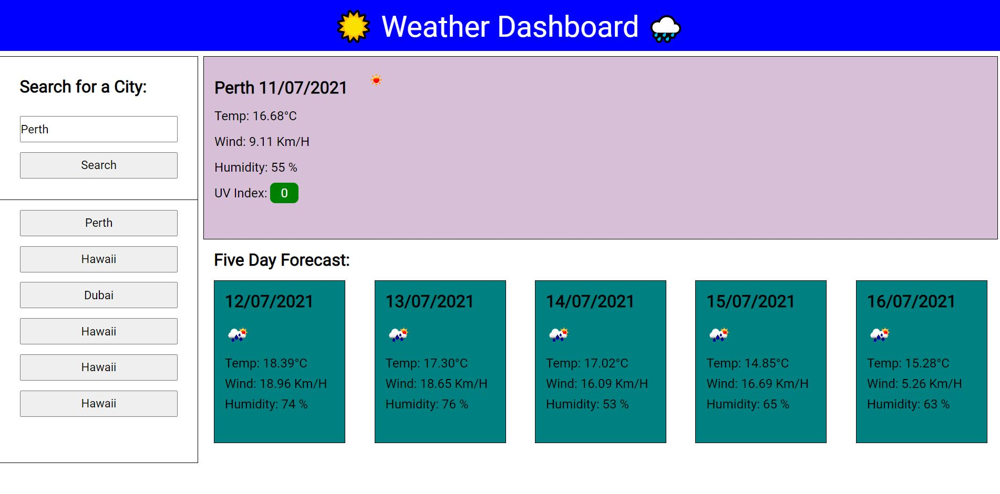

# HomeworkSix

Homework Six - very inefficient method used in my for loop that I now understand, may fix it at a later date.

## Acceptance criteria.

Weather app that accepts a city search and returns today + 5 day forecast weather information.

Weather information includes name, date, icon, temperature, humidity, wind speed and UVI.

UVI background colour changes to reflect severity.

Entering a city will create a search history button - clicking this button will render relevant weather information.